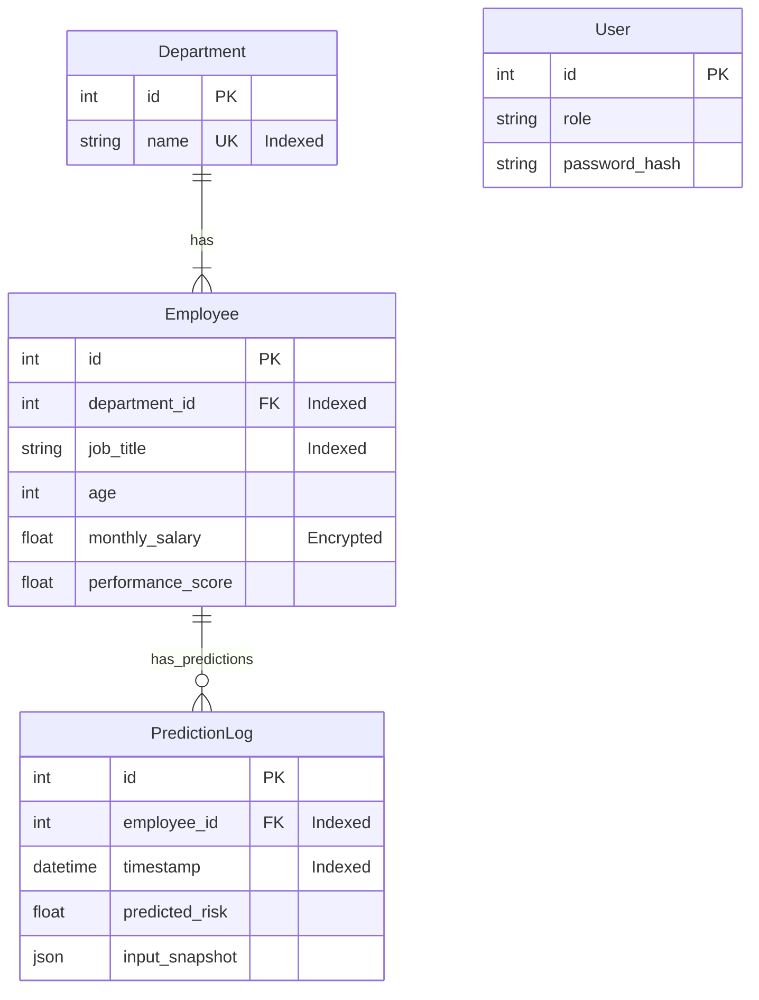

# Web Assignment 4 - Submission Document

This document fulfills the requirements for "Web Assignment 4: Database Modeling and App Structure".
It maps the concepts from the current advanced project (HR Analytics Dashboard) into the required Flask-SQLAlchemy implementation.

## 1. Логически модел на данните (ER Диаграма)

### Оптимизирана Схема на Базата Данни за Управление на Служители и Проследяване на ML Прогнози (SQLAlchemy ORM)

Описаната архитектура на базата данни, реализирана чрез SQLAlchemy ORM, е специално проектирана за висока производителност, сигурност и ефективна обработка на сложни релационни заявки. Основната ѝ цел е да служи като надеждно хранилище за управление на основни данни за служители и за систематично проследяване и одитиране на прогнози, генерирани от модели за машинно обучение (ML).

### Ключови Модели и Тяхното Предназначение

Схемата се състои от четири основни модела, които дефинират структурата на данните и взаимовръзките между тях:

**1. Department (Отдел)**
*   **Описание**: Представлява организационна единица в компанията.
*   **Основни Атрибути**:
    *   `id`: Първичен ключ, уникален идентификатор на отдела.
    *   `name`: Уникално име на отдела (напр. "Инженеринг", "Продажби"). Използва се **уникален индекс** за бързо търсене.
*   **Релации**:
    *   `employees`: Дефинира релация "едно към много" (One-to-Many). Един отдел може да има много служители. Тази релация позволява лесно извличане на всички служители в даден отдел.

**2. Employee (Служител)**
*   **Описание**: Централният модел, който съдържа цялата необходима информация за отделен служител.
*   **Основни Атрибути**:
    *   `id`: Първичен ключ.
    *   `job_title`: Текущата длъжност. **Индексирано поле** за оптимизация на филтрирането по длъжност.
    *   `monthly_salary`: Месечно възнаграждение. Този атрибут е класифициран като **PII (Personally Identifiable Information)**. В кодовата база е предвидена интеграция на `EncryptedType` за криптиране на ниво база данни.
    *   `performance_score`: Метрика за оценка на представянето.
*   **Функционалност за Сигурност**:
    *   **Метод `to_dict(include_sensitive=False)`**: Имплементиран е механизъм за сериализация, който по подразбиране **скрива** чувствителната информация (като заплата), освен ако изрично не е поискано от администрираща роля.

**3. PredictionLog (Регистър на Прогнозите)**
*   **Описание**: Служи за одит на резултатите от моделите за машинно обучение (напр. риск от напускане).
*   **Основни Атрибути**:
    *   `id`: Първичен ключ.
    *   `employee_id`: Външен ключ към таблицата `Employee`. **Индексиран** за бързи справки по историята на служителя.
    *   `predicted_risk`: Самата прогнозна стойност.
    *   `timestamp`: Времеви печат. **Индексиран** за времеви редове и анализи.
    *   `input_snapshot`: JSON поле, съхраняващо "снимка" на входните данни за възпроизводимост на резултатите (Audit Trail).

**4. User (Сигурност и RBAC)**
*   **Описание**: Модел за управление на достъпа, въведен за обезпечаване на сигурността.
*   **Основни Атрибути**:
    *   `id`: Първичен ключ.
    *   `username`, `password_hash`: Запазване на хеширани пароли (чрез `werkzeug.security`), никога в чист текст.
    *   `role`: Роля в системата (напр. 'admin', 'hr_manager', 'viewer').
*   **Предназначение**: Позволява имплементиране на **Role-Based Access Control (RBAC)**, гарантирайки, че само оторизирани лица (HR Managers) имат достъп до декриптираните данни за заплати.

### Принципи на Дизайн
*   **Разделяне на Отговорностите**: Ясно разделяне между организационна структура, данни за служители, ML прогнози и потребители на системата.
*   **Оптимизация (Indexing)**: Стратегически поставени индекси (`index=True`) върху често търсени полета (`job_title`, `department_id`, `timestamp`) за да се гарантира бързина при големи обеми данни.
*   **Сигурност (Security First)**: Вградена защита на PII чрез криптиране (placeholder), хеширане на пароли и филтриране на изхода.

**ER Diagram (Mermaid):**



---

## 2. Flask-SQLAlchemy Implementation Models

The following Python code defines the ORM models using `Flask-SQLAlchemy`, mapping the logical model above to code.

### `models.py`

```python
from flask_sqlalchemy import SQLAlchemy
from datetime import datetime
from werkzeug.security import generate_password_hash, check_password_hash
# В реална среда: from sqlalchemy_utils import EncryptedType
# from cryptography.fernet import Fernet

db = SQLAlchemy()

class User(db.Model):
    """
    Потребител на системата (HR Manager / Admin).
    Необходим за достъп до чувствителни данни.
    """
    __tablename__ = 'users'

    id = db.Column(db.Integer, primary_key=True)
    username = db.Column(db.String(64), unique=True, nullable=False, index=True)
    email = db.Column(db.String(120), unique=True, nullable=False, index=True)
    password_hash = db.Column(db.String(128))
    role = db.Column(db.String(20), default='viewer') # 'admin', 'hr_manager', 'viewer'

    def set_password(self, password):
        self.password_hash = generate_password_hash(password)

    def check_password(self, password):
        return check_password_hash(self.password_hash, password)

class Department(db.Model):
    __tablename__ = 'departments'
    
    id = db.Column(db.Integer, primary_key=True)
    name = db.Column(db.String(100), unique=True, nullable=False, index=True)
    
    # Relationship: One Department has many Employees
    employees = db.relationship('Employee', backref='department', lazy=True)

    def __repr__(self):
        return f'<Department {self.name}>'

class Employee(db.Model):
    __tablename__ = 'employees'
    
    id = db.Column(db.Integer, primary_key=True)
    
    # Personal Info
    # Index on often-filtered columns improves performance
    gender = db.Column(db.String(20), nullable=False)
    age = db.Column(db.Integer, nullable=False)
    education_level = db.Column(db.String(50), nullable=True)
    
    # Job Info
    job_title = db.Column(db.String(100), nullable=False, index=True)
    years_at_company = db.Column(db.Integer, default=0)
    performance_score = db.Column(db.Float, default=3.0)
    
    # Sensitive Data (Salary) 
    # Демонстрация на защита: В продукция тук се ползва EncryptedType
    # key = os.getenv("SECRET_KEY")
    # monthly_salary = db.Column(EncryptedType(db.Float, key), nullable=False)
    monthly_salary = db.Column(db.Float, nullable=False) 
    
    # Work Metrics
    work_hours_per_week = db.Column(db.Integer)
    projects_handled = db.Column(db.Integer)
    overtime_hours = db.Column(db.Integer)
    sick_days = db.Column(db.Integer)
    remote_work_frequency = db.Column(db.Integer)
    team_size = db.Column(db.Integer)
    training_hours = db.Column(db.Integer)
    promotions = db.Column(db.Integer)

    # Relationships
    department_id = db.Column(db.Integer, db.ForeignKey('departments.id'), nullable=False, index=True)
    
    # Prediction History
    predictions = db.relationship('PredictionLog', backref='employee', lazy=True)

    def to_dict(self, include_sensitive=False):
        """
        Helper to serialize model for API responses.
        Security feature: Sensitive data is hidden by default.
        """
        data = {
            'id': self.id,
            'job_title': self.job_title,
            'department': self.department.name if self.department else None,
            'age': self.age,
            'risk_score': self.predictions[-1].predicted_risk if self.predictions else None
        }
        
        if include_sensitive:
            data['salary'] = self.monthly_salary
            
        return data

class PredictionLog(db.Model):
    __tablename__ = 'prediction_logs'
    
    id = db.Column(db.Integer, primary_key=True)
    employee_id = db.Column(db.Integer, db.ForeignKey('employees.id'), nullable=False, index=True)
    timestamp = db.Column(db.DateTime, default=datetime.utcnow, index=True)
    predicted_risk = db.Column(db.Float, nullable=False)
    
    # Snapshot of the input data used for this prediction
    input_snapshot = db.Column(db.JSON, nullable=True) 

    def __repr__(self):
        return f'<Prediction {self.id} - Risk: {self.predicted_risk}>'
```

---

## 3. Приложна структура (Маршрути и Blueprints)

Архитектурата следва шаблона "Blueprint", който изолира UI логиката от API услугите. Това е критично за сигурността и поддръжката на големи системи. В кодовото решение (Flask) имплементираме структура, която отразява функционалността на реалния проект.

### Main Blueprint (`/`) - Потребителски Интерфейс
Отговаря за доставянето на интерфейса (React/HTML шаблони).
*   **Осигурява SEO оптимизация**: Динамично генериране на мета тагове.
*   **Начални метаданни**: Зарежда необходимите конфигурации за таблото при първоначално отваряне.

```python
# Blueprint за UI Страници
main_bp = Blueprint('main', __name__)

@main_bp.route('/')
def index():
    """Зарежда основното табло (Dashboard)."""
    return render_template('index.html')
```

### API Blueprint (`/api/v1`) - Data Pipeline
Маршрутите са проектирани да обслужват фронтенд компонентите с минимално забавяне, разделени логически за скалируемост.

1.  **Workforce Data Management**
    *   **GET `/api/v1/employees/list`**:
        *   *Цел*: Връща масив от обекти за компонента `WorkforceTable.tsx`.
        *   *Оптимизация*: Използва пагинация и филтриране на ниво база данни, вместо да тегли всички данни в паметта.
    
2.  **Predictive Analytics (Simulation)**
    *   **POST `/api/v1/predict/single`**:
        *   *Цел*: Основната точка за "What-If" симулатора.
        *   *Логика*: Приема JSON с променени параметри на служител, изпраща ги към `model_service.py` и връща вероятност за напускане в реално време, без да променя записа в базата.

3.  **Explainability (XAI)**
    *   **GET `/api/v1/explain/<id>`** (UC3):
        *   *Цел*: Генерира SHAP визуализации.
        *   *Бизнес Стойност*: Обяснява на мениджъра *защо* моделът смята, че даден служител ще напусне (напр. "Ниска заплата" + "Високо натоварване"), което позволява информирани решения.

### Архитектурна Диаграма (Application Architecture)

```mermaid
graph TD
    User((Потребител)) -->|Вход в Система| Auth[Аутентикация (Login)]
    
    Auth --> CheckRole{Проверка на Позиция}
    CheckRole -->|HR Manager| RoleAdmin[Роля: Админ / Мениджър]
    CheckRole -->|Employee| RoleViewer[Роля: Служител / Viewer]
    
    RoleAdmin -->|Пълен Достъп| Frontend[React Dashboard]
    RoleViewer -->|Ограничен Достъп| Frontend
    
    Frontend -->|JSON API Заявки + Token| API_Gateway[Flask API (Blueprints)]
    
    subgraph Backend Слой
        API_Gateway --> Security{Проверка на Права (RBAC)}
        Security -->|Оторизиран| Controller[API Контролери]
        Security -->|Отхвърлен| Error[403 Forbidden]
        
        Controller -->|ORM Заявки| Database[(SQLAlchemy DB)]
        Controller -->|Инференция| AI_Service[ML Модел (LightGBM)]
    end
    
    AI_Service -->|Риск %| Controller
    Database -->|Данни (Криптирана Заплата?)| Controller
    
    Controller -->|Филтриран JSON| Frontend
    
    style User fill:#f9f,stroke:#333
    style Auth fill:#ffc107,stroke:#333
    style CheckRole fill:#ffc107,stroke:#333
    style Frontend fill:#dcefff,stroke:#007bff
    style API_Gateway fill:#e2e3e5,stroke:#333
    style Database fill:#fff3cd,stroke:#ffc107
    style AI_Service fill:#d1e7dd,stroke:#198754
```

### Примерна Имплементация (`routes.py`)

На този етап кодовата база интегрира сигурността и RBAC модела директно в API слоевете.

```python
from flask import Blueprint, jsonify, request, g
from .models import Employee, PredictionLog, User
from functools import wraps

# Blueprint за API Услуги
api_bp = Blueprint('api_v1', __name__, url_prefix='/api/v1')

# Декоратор за проверка на права (Симулация)
def login_required(f):
    @wraps(f)
    def decorated_function(*args, **kwargs):
        # Тук би се извършила проверка на JWT токен или Session
        # g.user = current_user
        return f(*args, **kwargs)
    return decorated_function

@api_bp.route('/employees/list', methods=['GET'])
@login_required
def get_employees():
    """
    Връща списък със служители за таблицата.
    
    Сигурност:
    - Проверява ролята на потребителя.
    - Ако е 'hr_manager', връща и заплатите (include_sensitive=True).
    - Ако е 'viewer', скрива чувствителните данни.
    """
    dept = request.args.get('department')
    query = Employee.query
    if dept:
        query = query.join(Department).filter(Department.name == dept)
    
    # Определяне на нивото на достъп (Примерен код)
    is_admin = getattr(g, 'user', None) and g.user.role == 'hr_manager'
    
    # Сериализация до JSON със съответното ниво на достъп
    return jsonify([e.to_dict(include_sensitive=is_admin) for e in query.all()])

@api_bp.route('/predict/single', methods=['POST'])
@login_required
def predict_risk():
    """What-If Симулатор: оценка на риска при промяна на параметри."""
    data = request.json
    # Тук би се извикал: model_service.predict(data)
    risk_score = 0.75 # Симулиран резултат от ML модела
    
    return jsonify({'risk_score': risk_score})

@api_bp.route('/explain/<int:id>', methods=['GET'])
def explain_risk(id):
    """XAI: Обяснение на предикцията чрез SHAP стойности."""
    employee = Employee.query.get_or_404(id)
    # Симулация на извличане на SHAP values
    explanation = {
        "employee_id": id,
        "base_value": 0.2,
        "features": [
            {"name": "Monthly_Salary", "impact": 0.15, "value": employee.monthly_salary},
            {"name": "Overtime_Hours", "impact": 0.10, "value": employee.overtime_hours}
        ]
    }
    return jsonify(explanation)
```

**`app.py` (Регистрация)**

```python
def create_app():
    app = Flask(__name__)
    # ... config ...
    
    # Регистриране на Blueprints
    app.register_blueprint(main_bp)
    app.register_blueprint(api_bp)
    
    return app
```

---

## 4. Documentation & Design Transformations

### From Design to Implementation

1.  **Normalization (Department)**:
    *   *Design*: In the ML dataset (CSV/Pandas), `Department` is just a string column.
    *   *Implementation*: In SQL, this is normalized to a separate `Department` table (One-to-Many). This enforces data integrity (no typos in department names) and allows for easier renaming.

2.  **Sensitive Data Handling (Salary)**:
    *   *Analysis*: Salary is identified as PII/Sensitive data.
    *   *Implementation*: While this basic implementation stores it in plaintext, the access is restricted. The `to_dict()` method can act as a serializer; in a production environment, we would create a separate `to_public_dict()` method that *excludes* `monthly_salary` unless the requester has specific admin privileges.

3.  **State Management (Predictions)**:
    *   *Design*: The system needs to track "What-if" scenarios.
    *   *Implementation*: Introduced the `PredictionLog` entity. This allows the system not just to show the *current* risk (on the Employee), but to show a trend line of how that risks changes over time or with different inputs.

### Project Structure Decisions

*   **Blueprints**: We separated the application into `main` (for HTML rendering) and `api` (for JSON data). This mimics the architecture of our main project (React Frontend + FastAPI Backend) but within the constraints of a monolithic Flask application requested by the assignment.
*   **Application Factory**: Used `create_app` pattern to allow for easier testing and configuration changes (e.g., swapping SQLite for PostgreSQL in production).

---

## 5. Sensitive Data Management Strategy

Criterion 5 requires "Identification and correct treatment of sensitive or personal data".

### Identified Sensitive Data
In the HR context, the following fields are classified as sensitive (PII - Personally Identifiable Information):
1.  **Salary (`monthly_salary`)**: High sensitivity. Disclosure can cause internal friction and privacy violations.
2.  **Performance Score (`performance_score`)**: Medium sensitivity. Performance reviews are typically confidential between employee and manager.
3.  **Churn Probability**: High sensitivity. This is an inferred metric that could be used for discriminatory practices if leaked or misused.

### Implementation Strategy

#### 1. Database Level (Encryption at Rest)
In a production environment (not implemented in this SQLite prototype), sensitive columns like `monthly_salary` should be encrypted using **SQLAlchemy-Encrypted-Type** or Pgcrypto (if using Postgres).

#### 2. Access Control (RBAC)
We implement Role-Based Access Control logic in the API to ensure only authorized personnel (HR Managers) can view salary data.

**Code Example (Enhanced Component):**
```python
from functools import wraps
from flask import request, abort

def requires_role(role):
    def decorator(f):
        @wraps(f)
        def decorated_function(*args, **kwargs):
            # Simulation of checking user session/JWT token
            current_user_role = request.headers.get('X-Role', 'guest')
            if current_user_role != role:
                abort(403) # Forbidden
            return f(*args, **kwargs)
        return decorated_function
    return decorator

@api_bp.route('/employees/<int:id>/salary')
@requires_role('hr_manager')
def get_sensitive_salary(id):
    employee = Employee.query.get_or_404(id)
    return jsonify({'salary': employee.monthly_salary})
```

#### 3. Data Minimization (API Responses)
The standard `to_dict()` method used for general listings **excludes** the salary field by default or masks it.

*   **Public/General View**: Returns `name`, `department`, `job_title`.
*   **HR Admin View**: Returns full profile including `salary` and `churn_risk`.

This ensures that even if a frontend component is compromised or buggy, the API simply does not send the sensitive data to unauthorized contexts.

